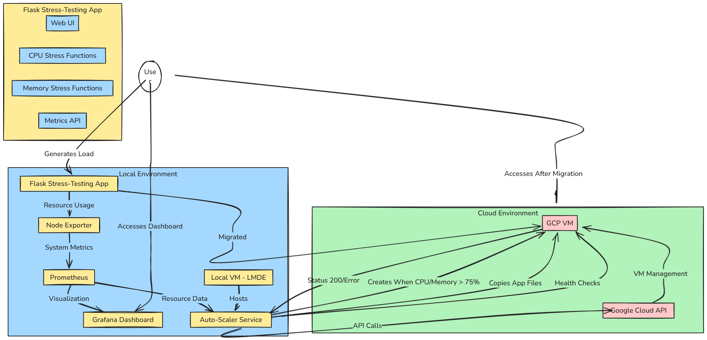

# vcc-assignment-3: Auto-Scaling System - Local VM to GCP

## Overview

This project implements an intelligent auto-scaling system that monitors resource usage on a local VM and automatically creates and migrates to a Google Cloud Platform (GCP) VM when resource usage exceeds a defined threshold (75% CPU or memory). The system includes a stress-testing Flask application with a web UI, comprehensive monitoring with Prometheus and Grafana, and a Python auto-scaler service that manages the migration.

## System Architecture Diagram



## Key Features

- **Resource Monitoring**: Real-time monitoring of CPU and memory usage using Prometheus and Node Exporter
- **Visualization Dashboard**: Grafana dashboard for monitoring system metrics
- **Stress Testing Tool**: Web-based Flask application for generating controlled CPU and memory load
- **Automatic Scaling**: Python service that detects high resource usage and creates a GCP VM
- **Application Migration**: Seamless application transfer from local VM to cloud
- **Health Checking**: Continuous monitoring of cloud VM status with automatic recreation if deleted

## System Architecture

The system consists of the following components:

- **Local Environment**:
  - Linux Mint Debian Edition (LMDE) VM running on VirtualBox
  - Flask stress-testing application
  - Prometheus + Node Exporter for monitoring
  - Grafana for visualization
  - Auto-scaler Python service

- **Cloud Environment**:
  - Google Cloud Platform VM (e2-medium)
  - Identical Flask stress-testing application
  - Nginx as reverse proxy

## Prerequisites

- VirtualBox with LMDE VM
- Google Cloud Platform account with billing enabled
- Python 3.x environment
- Network connectivity for GCP API access

## Installation and Setup

All commands for setup are available in the `commands.bash` file included in this repository. The file contains script commands for:

1. Setting up monitoring tools (Prometheus, Node Exporter, Grafana)
2. Installing the Flask stress-testing application
3. Configuring the auto-scaler service
4. Setting up GCP credentials and permissions
5. Creating necessary GCP firewall rules

## Directory Structure

auto-scale-project/
├── app.py                    # Flask stress-testing application
├── auto_scaler.py            # Auto-scaling logic and GCP integration
├── templates/                # Flask application templates
│   └── index.html            # Web UI for stress testing
├── gcp/                      # GCP-related files
│   └── startup-script.sh     # Startup script for GCP VM
├── commands.bash             # All setup and configuration commands
└── README.md

## Usage Instructions

### Starting the Local Environment

1. Start the monitoring services:

   ```bash
   sudo systemctl start node_exporter prometheus grafana-server
   ```

2. Start the Flask stress-testing application:

   ```bash
   sudo systemctl start stress-app
   ```

3. Start the auto-scaler service:

   ```bash
   sudo systemctl start auto-scaler
   ```

   ```bash
   sudo systemctl start auto-scaler
   ```

### Accessing the Web Interfaces

- **Flask Stress-Testing App**: `http://<local-vm-ip>:5000`
- **Grafana Dashboard**: `http://<local-vm-ip>:3000` (default login: admin/admin)
- **Prometheus**: `http://<local-vm-ip>:9090`

### Triggering Auto-Scaling

1. Open the Flask application UI
2. Use the CPU or Memory stress testing options to generate load:
   - Set CPU cores to use all available cores
   - Set duration to a value high enough to sustain load (e.g., 300 seconds)
   - Click "Start CPU Stress" or adjust memory allocation and click "Start Memory Stress"

3. Monitor the auto-scaler logs:

   ```bash
   tail -f ~/auto-scale-project/auto_scaler.log
   ```

4. When resource usage exceeds 75% for the configured number of consecutive checks, the auto-scaler will:
   - Create a GCP VM
   - Deploy the Flask application to it
   - Provide the external IP for access

### After Migration

- The stress-testing application will be accessible via the GCP VM's external IP
- The local application service may be stopped to conserve resources
- The auto-scaler continues to monitor the GCP VM's health and will recreate it if deleted

## Stopping Services to Prevent Billing

Use these commands to stop all services and prevent GCP billing:

```bash
# Stop GCP VM (stops compute billing)
gcloud compute instances stop auto-scaled-vm --zone=us-central1-a

# Or delete it completely
gcloud compute instances delete auto-scaled-vm --zone=us-central1-a --quiet

# Stop local services
sudo systemctl stop auto-scaler
sudo systemctl stop stress-app
sudo systemctl stop grafana-server prometheus node_exporter
```

## Restarting Services

Use these commands to restart the system:

```bash
# Start local services
sudo systemctl start node_exporter prometheus grafana-server
sudo systemctl start stress-app
sudo systemctl start auto-scaler

# Start existing GCP VM (if stopped)
gcloud compute instances start auto-scaled-vm --zone=us-central1-a
```

## Troubleshooting

### Nginx Welcome Page Instead of Flask App

If you see the default Nginx welcome page on your GCP VM:

1. SSH into the GCP VM:

   ```bash
   gcloud compute ssh auto-scaled-vm --zone=us-central1-a
   ```

2. Check if the Flask app is running:

   ```bash
   sudo systemctl status flask-app
   ```

3. Check Nginx configuration:

   ```bash
   cat /etc/nginx/sites-available/flask-app
   ```

4. Fix the configuration if needed (see `commands.bash` for details)

### Auto-Scaling Not Working

1. Check the auto-scaler logs:

   ```bash
   cat ~/auto-scale-project/auto_scaler.log
   ```

2. Verify GCP credentials:

   ```bash
   gcloud auth list
   ```

3. Check permissions:

   ```bash
   gcloud projects get-iam-policy YOUR_PROJECT_ID
   ```

## License

This project is licensed under the MIT License - see the LICENSE file for details.

## Contributors

- Sunirban-Sarkar

## Acknowledgements

- Google Cloud Platform documentation
- Flask, Prometheus, and Grafana communities
- VirtualBox documentation

---

*Note: This project was developed as a demonstration of cloud auto-scaling concepts and is intended for educational purposes.*
